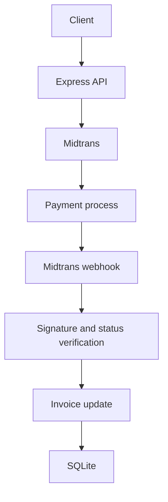

# Midtrans Payment API

RESTful payment API demonstrating Midtrans Snap and Core API integration, secure webhook handling, transaction persistence, automated testing, API documentation, and Dockerized deployment. Built as a Software Engineer backend portfolio project with Express and TypeScript.

## Features

- Snap payment token and redirect URL
- Core payments with bank transfer, GoPay, and QRIS
- Transaction status, cancel, and expire operations
- Signed Snap and Core webhooks with a Midtrans status lookup before invoice updates
- SQLite invoice persistence through Sequelize and migrations
- Request validation, Swagger documentation, Jest tests, and Docker

## Architecture



Routes define endpoints and validation; controllers handle HTTP responses; the payment service calls Midtrans and the Invoice model. A callback updates an existing invoice only after verifying its signature, amount, and current transaction details with Midtrans. Repeated callbacks with the same status do not write another update. Core generates a UUID based order ID; Snap accepts the caller's order ID.

## Tech stack

Node.js, Express 5, TypeScript, Midtrans Client, Sequelize, SQLite, Zod, Jest, Supertest, Swagger, and Docker.

## Setup

Use Node.js 22 or newer. Copy `.env.example` to `.env` and set sandbox Midtrans credentials. Never commit real credentials.

```bash
npm ci
npm run migrate
npm run dev
```

For a production build:

```bash
npm run build
npm run migrate
npm start
```

The default database path is `./database/payment.sqlite`; create the `database` directory first when running locally. Set `DATABASE_PATH` to another writable SQLite file if needed. `MIDTRANS_IS_PRODUCTION=true` selects Midtrans production; the default is sandbox. Configure Midtrans notifications to use `/api/core/transaction-callback` or `/api/snap/payment-callback`. `MIDTRANS_CALLBACK_URL` configures the optional GoPay client callback URL and is separate from server webhooks.

Existing databases created by the old `sequelize.sync()` startup can be retained. The initial migration detects an existing `Invoices` table and adds the unique order ID index. Resolve any preexisting duplicate order IDs before running the migration.

## API documentation

Swagger UI: `http://localhost:3000/api-docs` in development. API routes start with `/api`. Documentation is disabled when `NODE_ENV=production`.

## Testing

```bash
npm test -- --runInBand
npm run build
```

Tests mock Midtrans requests and cover creation, operations, validation, forged callbacks, amount mismatch, unknown orders, and repeated notifications.

## Docker

```bash
docker compose up --build
```

The container runs migrations before starting the API and stores SQLite data in the mounted `database` directory. Set credentials in `.env` before starting it.

## Security

Webhook signatures use Midtrans SHA-512 and a timing safe comparison. The server rejects unsigned notifications and checks invoice amount and transaction status against Midtrans before changing an invoice. Credentials are read from environment variables; error responses do not include upstream error details. Keep the server key private.

License: ISC. See [LICENSE](LICENSE).
